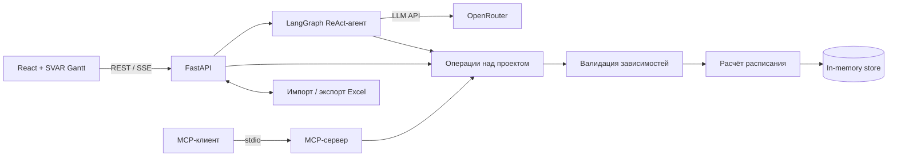

# BIOCAD Gantt Chart

Прототип веб-приложения для планирования проектов. В нём можно работать с диаграммой Ганта, редактировать задачи на естественном языке, импортировать и экспортировать Excel-файлы, проверять зависимости и считать трудозатраты. Основной сценарий показан в [демо-видео](docs/demo.mp4).

## Быстрый запуск

Понадобятся Python 3.11+, [uv](https://docs.astral.sh/uv/) и Node.js 20+.

```bash
git clone https://github.com/ngusika-cloud/BIOCAD-test-task.git
cd BIOCAD-test-task
cp .env.example .env  # PowerShell: Copy-Item .env.example .env

cd backend
uv sync --all-groups
uv run uvicorn backend.main:app --reload
```

Во втором терминале запустите frontend:

```bash
cd frontend
npm ci
npm run dev
```

Приложение откроется на [http://localhost:5173](http://localhost:5173), документация API доступна на [http://localhost:8000/docs](http://localhost:8000/docs). В dev-режиме Vite перенаправляет запросы `/api` и `/health` на backend.

Опубликованный сайт размещён на Render. Из России и Render, и сайт доступны только через VPN.

## Переменные окружения

Скопируйте `.env.example` в корневой `.env`. Этот файл не должен попадать в Git. Если frontend размещён отдельно, задайте переменную Vite в `frontend/.env.local`.


| Переменная                       | Назначение                                                           | Значение по умолчанию                 |
| -------------------------------- | -------------------------------------------------------------------- | ------------------------------------- |
| `OPENROUTER_API_KEY`             | Ключ OpenRouter, нужен только для AI-ассистента                      | не задано                             |
| `OPENROUTER_MODEL`               | Модель ассистента                                                    | `openai/gpt-5.6-luna`                 |
| `OPENROUTER_SITE_URL`            | HTTP Referer для OpenRouter                                          | URL опубликованного приложения        |
| `AGENT_MAX_TOOL_CALLS_PER_ROUND` | Максимум операций в одном пакете агента                              | `10`                                  |
| `AGENT_RECURSION_LIMIT`          | Общий предел шагов графа агента                                      | `50`                                  |
| `CORS_ORIGINS`                   | Разрешённые origins через запятую                                    | `http://localhost:5173`               |
| `VITE_API_URL`                   | Адрес API в `frontend/.env.local` для отдельно размещённого frontend | пусто, используются относительные URL |


## Проверки и воспроизводимость

Версии Python-зависимостей зафиксированы в `backend/uv.lock`, frontend-зависимостей - в `frontend/package-lock.json`. Для установки используйте `uv sync --all-groups` и `npm ci`; lock-файлы удалять не нужно.

```bash
cd backend
uv run pytest
uv run pre-commit run --all-files --config ../.pre-commit-config.yaml

cd ../frontend
npm run build
```

Pre-commit запускает Ruff: проверяет код, сортирует импорты и форматирует файлы. Тестовые Excel-файлы лежат в `sample/`.
В `sample/import-tests/` собраны примеры таблиц для проверки импорта: файлы `01`, `02` и `03` на английском языке, а `04` и `05` - на русском.

Данные приложения пока хранятся в памяти. После перезапуска backend они сбрасываются к начальному набору.

## Архитектура




- Frontend собран на React 19, TypeScript, Vite и SVAR React Gantt. Он работает с backend через REST API, а ответы ассистента получает по SSE.
- Backend использует FastAPI, Pydantic и Uvicorn. REST API и stdio MCP-сервер вызывают одни и те же операции над проектом.
- Планировщик проверяет уникальность задач, ссылки и циклы, затем рассчитывает даты и человеко-часы. Эти расчёты детерминированы: LLM в них не участвует.
- ReAct-агент на LangGraph обращается к OpenRouter и меняет план только через валидируемые инструменты.
- Данные хранятся в памяти, это сознательное упрощение демонстрационной версии. За работу с Excel отвечает openpyxl.

Код разделён на модели, хранилище, планировщик, Excel-адаптер, API и агента. REST и MCP используют общую бизнес-логику. Изменения проверяются целиком до сохранения, критичные части покрыты unit- и API-тестами, а типизацию и стиль контролируют Ruff и pre-commit.

## Как я использовал AI при разработке

AI был моим рабочим инструментом на всём цикле.

- Вместе с ассистентом я разложил задание на пользовательские сценарии, компоненты и критерии готовности. Результат записан в [docs/task-tech.md](docs/task-tech.md).
- С его помощью исследовал готовые решения и спроектировал связку React, FastAPI, SVAR Gantt, MCP и OpenRouter. Расчёт расписания и проверка изменений при этом остались на детерминированном backend.
- Разрабатывал короткими вертикальными срезами: UI, API, импорт и экспорт Excel, затем агент. AI помогал разбирать проблемы с CORS, timeline, SSE streaming и лимитами tool calls.
- Результат проверял backend-тестами, TypeScript build, Ruff, pre-commit, просмотром diff и mock-ответами OpenRouter. Секреты в prompts не передавал. Архитектурные и продуктовые решения принимал сам.

В прототипе используется `openai/gpt-5.6-luna`. На 18 августа 2026 года [OpenRouter берёт $0,20 за миллион входных токенов и $1,20 за миллион выходных](https://openrouter.ai/openai/gpt-5.6-luna-20260709). Модель поддерживает tool calls и достаточно быстро применяет изменения, как требует задание. Другие модели, которые я использовал, и план benchmark собраны в [roadmap](docs/ROADMAP_TO_PRODUCTION.md).

## Ограничения прототипа

Сейчас данные хранятся в памяти, схема ограничена, поддерживается один проект и фиксированный список сотрудников. Для каждого человека принято восемь часов работы в календарный день.

В прототипе нет корпоративного входа, разграничения прав, аудита, совместного редактирования, индивидуальных календарей и шаблонов повторяющихся проектов. Render и внешний OpenRouter подходят для демонстрации. Для production понадобятся собственный или другой одобренный BIOCAD hosting, доступный сотрудникам без VPN, защита корпоративных данных, постоянное хранилище и более ограниченный AI-конвейер.

План перехода и оценка затрат собраны в [docs/ROADMAP_TO_PRODUCTION.md](docs/ROADMAP_TO_PRODUCTION.md).

Лицензия: [MIT](LICENSE).
