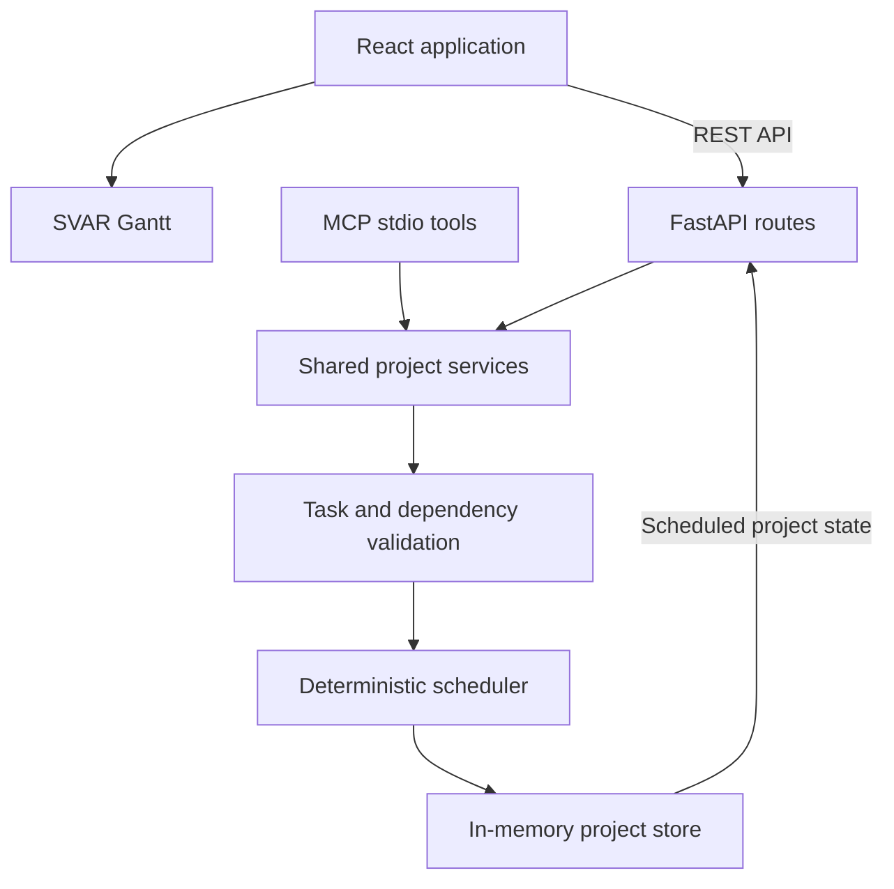

# PlanPilot

PlanPilot is a desktop-first planning workspace for biotech teams. It combines an interactive Gantt chart with natural-language plan editing, validated Excel import/export, task details, and one-step undo. This milestone uses a deterministic mock assistant; no LLM key is required.

## What works

- Seed project with 12 tasks, parallel branches, dependencies, and five assignees
- Interactive [SVAR React Gantt](https://svar.dev/react/gantt/) (MIT open-source edition)
- Task selection, details editing, dependency validation, and deletion
- Excel preview, validation, confirmation, export, and round-trip support
- Mock chat commands for assignment, moves, new tasks, dependencies, and bulk moves
- One-step undo and seed reset
- FastAPI REST API and a stdio MCP server sharing the same store and scheduler

Example commands: Assign Hit analysis to Elena; Move Primary screening by 3 days; Add a 3-day QA task after Lead selection; Make Candidate review depend on QA; Move all of Anna's tasks by one week.

## Local development

Requirements: Node.js 20+ and Python 3.11+. Install [uv](https://docs.astral.sh/uv/) once if needed.

Backend:

    cd backend
    uv sync --all-groups
    uv run uvicorn backend.main:app --reload

Frontend, in another terminal:

    cd frontend
    npm ci
    npm run dev

Open http://localhost:5173. Vite proxies /api to FastAPI on port 8000.

Verification:

    cd backend
    uv run pytest
    uv run pre-commit run --all-files --config ../.pre-commit-config.yaml
    cd ../frontend
    npm run build

Install the Git hook locally with `cd backend` followed by
`uv run pre-commit install --config ../.pre-commit-config.yaml`.

## Architecture

The backend is the source of truth. Every REST or MCP mutation creates a candidate snapshot, validates identifiers and the dependency DAG, and only then commits and recalculates dates. The scheduler uses calendar days; roots begin at the project start, dependent tasks begin the day after their latest predecessor, and explicit move offsets are applied afterward. LLMs never calculate dates.

Data is intentionally in memory for the demo. Restarting the backend restores the seed.

## Excel format

The first row must contain task, description, executor, duration, and predecessors. Predecessors are comma-separated task names. Names must be unique; durations are whole days. See [sample/planpilot-sample.xlsx](sample/planpilot-sample.xlsx).

## API and MCP

REST includes health, project read/reset/undo, task create/update/delete, import preview/confirm, export, and mock chat. Interactive API docs are at http://localhost:8000/docs.

Start MCP with:

    cd backend
    uv run python -m backend.mcp_server

Tools: get_project_state, get_tasks, add_task, update_task, move_task, change_assignee, set_dependencies, and delete_task. They reuse the same business operations as REST.

## Environment

No environment variables are required in mock mode. .env.example reserves OPENROUTER_API_KEY and OPENROUTER_MODEL for the next milestone. VITE_API_URL may point the frontend at a separately hosted API.

## Key decisions

- SVAR provides a maintained React-native Gantt instead of a custom timeline.
- Chat chrome is local because the product needs compact, domain-specific change cards; assistant behavior stays behind one API.
- Import is two-phase so users inspect a validated replacement before committing.
- Internal IDs are stable; Excel translates predecessor names only at the boundary.
- One-step snapshot undo is enough for the demo and exposes a clear path to revision history.

## AI-assisted development

Codex was used to interpret the brief, compare the current SVAR package/API, scaffold the React/FastAPI implementation, and create tests. Package choices were checked against official documentation. All generated behavior was verified with a TypeScript production build, backend tests, and API smoke checks; AI output was not accepted as a substitute for those checks.

## Current limits

Mock intent parsing accepts fixed English command shapes and is not an LLM. State is process-local, dates use calendar days, task bar drag editing is not persisted, and there is no authentication or collaboration. See [Roadmap to production](docs/ROADMAP_TO_PRODUCTION.md).
