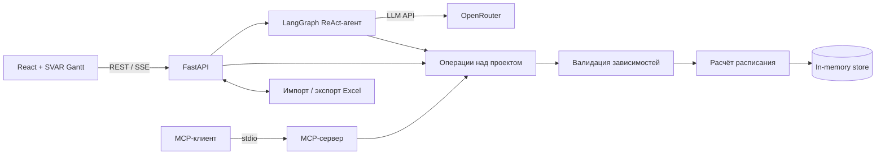

# BIOCAD Gantt chart

Веб-приложение для планирования проектов: диаграмма Ганта, редактирование задач на естественном языке, импорт и экспорт Excel, проверка зависимостей и расчёт трудозатрат.

## Быстрый запуск

Требования: Python 3.11+, [uv](https://docs.astral.sh/uv/) и Node.js 20+.

```bash
git clone https://github.com/ngusika-cloud/BIOCAD-test-task.git
cd BIOCAD-test-task
cp .env.example .env  # PowerShell: Copy-Item .env.example .env

cd backend
uv sync --all-groups
uv run uvicorn backend.main:app --reload
```

Во втором терминале:

```bash
cd frontend
npm ci
npm run dev
```

Приложение: http://localhost:5173, документация API: http://localhost:8000/docs. В dev-режиме Vite перенаправляет `/api` и `/health` на backend.

## Переменные окружения

Корневой файл `.env` создаётся из `.env.example` и не должен попадать в Git. Опциональная переменная Vite задаётся отдельно в `frontend/.env.local`.

| Переменная | Назначение | Значение по умолчанию |
| --- | --- | --- |
| `OPENROUTER_API_KEY` | Ключ OpenRouter; обязателен только для AI-ассистента | — |
| `OPENROUTER_MODEL` | Модель ассистента | `qwen/qwen3.7-flash` |
| `OPENROUTER_SITE_URL` | HTTP Referer для OpenRouter | URL опубликованного приложения |
| `AGENT_MAX_TOOL_CALLS_PER_ROUND` | Максимум операций в одном пакете агента | `10` |
| `AGENT_RECURSION_LIMIT` | Общий предел шагов графа агента | `50` |
| `CORS_ORIGINS` | Разрешённые origin через запятую | `http://localhost:5173` |
| `VITE_API_URL` | Адрес API в `frontend/.env.local` для отдельно размещённого frontend | пусто, используются относительные URL |

## Воспроизводимость и проверки

Версии Python-зависимостей зафиксированы в `backend/uv.lock`, frontend-зависимостей — в `frontend/package-lock.json`. Используйте `uv sync --all-groups` и `npm ci`, не удаляя lock-файлы.

```bash
cd backend
uv run pytest
uv run pre-commit run --all-files --config ../.pre-commit-config.yaml

cd ../frontend
npm run build
```

Pre-commit запускает Ruff для линтинга, сортировки импортов и форматирования. Тестовые Excel-файлы находятся в `sample/`. Данные приложения хранятся в памяти и после перезапуска backend сбрасываются к начальному набору.

## Архитектура и технологии



- **Frontend:** React 19, TypeScript, Vite и SVAR React Gantt. UI обращается к backend через REST API и SSE для потоковых ответов ассистента.
- **Backend:** FastAPI, Pydantic и Uvicorn. REST API и stdio MCP-сервер используют единые операции над проектом.
- **Планирование:** детерминированный scheduler проверяет уникальность задач, ссылки и отсутствие циклов, затем рассчитывает даты и человеко-часы. LLM даты не вычисляет.
- **AI:** ReAct-агент на LangGraph вызывает OpenRouter и изменяет план только через валидируемые инструменты.
- **Данные:** in-memory store — осознанное упрощение демонстрационной версии; Excel обрабатывается через openpyxl.

Поддерживаемость обеспечивают разделение моделей, хранилища, планировщика, Excel-адаптера, API и агента; единая бизнес-логика для REST/MCP; типизация; атомарная проверка снимка до сохранения; unit- и API-тесты; Ruff и pre-commit.

## Использование AI

AI использовался не только для генерации отдельных фрагментов кода, а как рабочий copilot на всём цикле задачи: от разбора требований до проверки deployment. Я строил работу короткими итерациями: давал модели ограниченный контекст и конкретный ожидаемый результат, проверял предложенное решение, запускал автоматические проверки и только после этого переходил к следующему этапу.

### Декомпозиция и управление scope

Первым шагом я вместе с AI разложил исходное описание на продуктовые сценарии, технические компоненты, проверки и критерии готовности. Результат сохранён в [docs/task-tech.md](docs/task-tech.md). Декомпозиция помогла:

- выделить основной пользовательский путь: seed Gantt → Excel import → изменение через AI → просмотр результата → export;
- отделить детерминированную бизнес-логику от поведения LLM;
- заранее определить модели данных, API, MCP tools, проверки Excel, happy paths агента и end-to-end сценарий;
- зафиксировать сознательные ограничения прототипа и не расширять scope функциями, которые не помогают показать основной сценарий;
- выполнять работу вертикальными срезами, в каждом из которых frontend, backend и проверка результата доводились вместе.

План не воспринимался как неизменяемая инструкция. Например, в процессе я отказался от непонятного пользователю Undo в интерфейсе, добавил нескольких исполнителей на задачу, локализацию, человеко-часы, streaming и отображение стоимости AI-запроса. Такие изменения принимались как продуктовые решения после проверки работающего интерфейса.

### Исследование и архитектурные решения

AI помогал собирать варианты и проверять их по документации, но окончательный выбор делался по требованиям задачи:

- для Gantt была выбрана готовая библиотека SVAR вместо разработки timeline с нуля;
- React и FastAPI разделены стабильным REST-контрактом, а streaming ответа реализован через SSE;
- backend оставлен source of truth: LLM не рассчитывает даты и не изменяет состояние напрямую;
- scheduler сделан детерминированным и отдельно проверяет неизвестные зависимости, self-dependency и циклы;
- REST и MCP используют одну бизнес-логику, чтобы одинаковая операция не имела разных правил в разных интерфейсах;
- OpenRouter key остаётся только на backend, а модель и лимиты агента задаются через environment variables;
- prompt вынесен в отдельный Jinja2 template, чтобы его можно было версионировать и менять независимо от Python-кода.

При выборе библиотек, API и параметров deployment я просил AI сверяться с первичными источниками и после этого проверял соответствие решения установленным версиям пакетов и фактической структуре проекта.

### Реализация с помощью AI

AI использовался для создания и последовательного улучшения React/FastAPI реализации:

- проектирование Pydantic- и TypeScript-моделей и синхронизация контрактов frontend/backend;
- scheduler, CRUD задач, import preview/confirm, Excel export и round-trip import → export → re-import;
- генерация реалистичного seed-проекта и нескольких `.xlsx` файлов разной длины для ручной проверки;
- Gantt UI, task modal, зависимости, переключение масштаба, переход к сегодняшней дате и выделение изменённых задач;
- русский и английский интерфейс, категориальный выбор нескольких исполнителей и автоматический расчёт человеко-часов;
- LangGraph/OpenRouter agent, типизированные tools, уточняющие вопросы, история диалога и короткие ответы;
- SSE streaming, очистка чата, отображение модели, токенов и фактической стоимости запроса;
- добавление/удаление отдельного исполнителя без замены остальных, batch updates и ограниченная обработка больших наборов операций.

Для изменений агента я отдельно следил за границей ответственности: модель интерпретирует намерение и формирует tool call, а Pydantic, ProjectStore и scheduler проверяют и применяют изменение. Ошибка модели поэтому не должна обходить правила предметной области.

### Поиск и исправление проблем

AI применялся как debugging partner: сначала собирались наблюдаемые симптомы и состояние кода, затем формировалась гипотеза, вносилось минимальное изменение и повторялась проверка. Таким способом были разобраны:

- некорректное переключение week/month/quarter и формат заголовков timeline;
- неработающая кнопка Today и отображение легенды изменённых задач;
- `Failed to fetch` после раздельного deployment frontend/backend и настройка CORS для Render;
- потоковая обработка OpenRouter SSE, включая финальный usage chunk;
- превышение recursion/tool-call limit: добавлены batch operation, лимит операций на раунд и продолжение отложенных вызовов;
- устаревающий контекст агента: system prompt обновляется по текущему состоянию проекта перед следующим model call;
- смешение локальных, пользовательских и сгенерированных изменений в Git: файлы проверялись через status/diff и коммиты делились по смыслу.

Это важное отличие от однократной генерации: AI не просто предлагал код, а участвовал в цикле диагностики, где каждое объяснение должно было подтверждаться воспроизводимым тестом или наблюдаемым поведением.

### Проверка и контроль качества

Результат AI не принимался по внешней правдоподобности. Для каждого типа изменения использовалась подходящая проверка:

- backend unit- и API-тесты для scheduler, agent tools, streaming, Excel и import/export round-trip;
- отдельные тесты для нескольких исполнителей, batch updates и продолжения операций после лимита раунда;
- TypeScript compilation и production build через `npm run build`;
- Ruff и pre-commit для форматирования, абсолютных импортов и статических ошибок Python;
- API smoke checks для `/health` и конфигурации модели;
- проверка, что prompt `.j2` попадает в собранный Python wheel;
- `git diff --check`, review изменённых файлов и логических commit boundaries перед push.

Реальный OpenRouter-вызов не использовался там, где поведение можно было надёжно проверить mock-response: это делало тесты воспроизводимыми, не тратило токены и не зависело от доступности внешнего провайдера. Для интеграции проверялись формат запросов, tool-call fragments, SSE events, usage и обработка ошибок.

### Deployment и документация

С помощью AI были подготовлены и проверены настройки двух Render services: build/start commands, `VITE_API_URL`, CORS и backend secrets. README, Mermaid-схема архитектуры и [Roadmap to Production](docs/ROADMAP_TO_PRODUCTION.md) также дорабатывались итеративно. В roadmap прототип рассматривается критически: описаны постоянное хранение, корпоративный вход, безопасность внешнего AI, масштабирование на проекты BIOCAD, отказ от ReAct в production, собственный benchmark моделей и ориентировочная экономика.

### Граница ответственности

AI ускорял анализ, реализацию, refactoring и проверку, но не заменял принятие решений. Я задавал scope и критерии, выбирал компромиссы, не передавал секреты в prompt, проверял ссылки и документацию, просматривал diff, запускал тесты и отвечал за содержимое коммитов. Такой процесс позволяет использовать AI интенсивно, сохраняя воспроизводимость разработки и контроль над продуктовым и техническим результатом.

## Ограничения

Нет постоянного хранилища, аутентификации и совместного редактирования; расчёт ведётся в календарных днях. План развития описан в [docs/ROADMAP_TO_PRODUCTION.md](docs/ROADMAP_TO_PRODUCTION.md).

Лицензия: [MIT](LICENSE).
