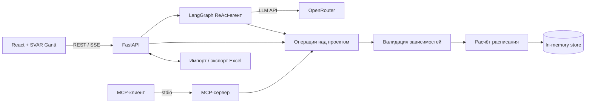

# BIOCAD Gantt chart

Веб-приложение для планирования проектов: диаграмма Ганта, редактирование задач на естественном языке, импорт и экспорт Excel, проверка зависимостей и расчёт трудозатрат.

## Быстрый запуск

Требования: Python 3.11+, [uv](https://docs.astral.sh/uv/) и Node.js 20+.

```bash
git clone https://github.com/ngusika-cloud/BIOCAD-test-task.git
cd BIOCAD-test-task
cp .env.example .env  # PowerShell: Copy-Item .env.example .env

cd backend
uv sync --all-groups
uv run uvicorn backend.main:app --reload
```

Во втором терминале:

```bash
cd frontend
npm ci
npm run dev
```

Приложение: http://localhost:5173, документация API: http://localhost:8000/docs. В dev-режиме Vite перенаправляет `/api` и `/health` на backend.

## Переменные окружения

Корневой файл `.env` создаётся из `.env.example` и не должен попадать в Git. Опциональная переменная Vite задаётся отдельно в `frontend/.env.local`.

| Переменная | Назначение | Значение по умолчанию |
| --- | --- | --- |
| `OPENROUTER_API_KEY` | Ключ OpenRouter; обязателен только для AI-ассистента | — |
| `OPENROUTER_MODEL` | Модель ассистента | `qwen/qwen3.7-flash` |
| `OPENROUTER_SITE_URL` | HTTP Referer для OpenRouter | URL опубликованного приложения |
| `AGENT_MAX_TOOL_CALLS_PER_ROUND` | Максимум операций в одном пакете агента | `10` |
| `AGENT_RECURSION_LIMIT` | Общий предел шагов графа агента | `50` |
| `CORS_ORIGINS` | Разрешённые origin через запятую | `http://localhost:5173` |
| `VITE_API_URL` | Адрес API в `frontend/.env.local` для отдельно размещённого frontend | пусто, используются относительные URL |

## Воспроизводимость и проверки

Версии Python-зависимостей зафиксированы в `backend/uv.lock`, frontend-зависимостей — в `frontend/package-lock.json`. Используйте `uv sync --all-groups` и `npm ci`, не удаляя lock-файлы.

```bash
cd backend
uv run pytest
uv run pre-commit run --all-files --config ../.pre-commit-config.yaml

cd ../frontend
npm run build
```

Pre-commit запускает Ruff для линтинга, сортировки импортов и форматирования. Тестовые Excel-файлы находятся в `sample/`. Данные приложения хранятся в памяти и после перезапуска backend сбрасываются к начальному набору.

## Архитектура и технологии



- **Frontend:** React 19, TypeScript, Vite и SVAR React Gantt. UI обращается к backend через REST API и SSE для потоковых ответов ассистента.
- **Backend:** FastAPI, Pydantic и Uvicorn. REST API и stdio MCP-сервер используют единые операции над проектом.
- **Планирование:** детерминированный scheduler проверяет уникальность задач, ссылки и отсутствие циклов, затем рассчитывает даты и человеко-часы. LLM даты не вычисляет.
- **AI:** ReAct-агент на LangGraph вызывает OpenRouter и изменяет план только через валидируемые инструменты.
- **Данные:** in-memory store — осознанное упрощение демонстрационной версии; Excel обрабатывается через openpyxl.

Поддерживаемость обеспечивают разделение моделей, хранилища, планировщика, Excel-адаптера, API и агента; единая бизнес-логика для REST/MCP; типизация; атомарная проверка снимка до сохранения; unit- и API-тесты; Ruff и pre-commit.

## Как я использовал AI-ассистентов при разработке

AI был рабочим copilot на всём цикле, а не источником непроверенного кода:

- вместе с ним я разложил задание на пользовательские сценарии, компоненты и критерии готовности; результат сохранён в [docs/task-tech.md](docs/task-tech.md);
- исследовал готовые решения и спроектировал связку React, FastAPI, SVAR Gantt, MCP и OpenRouter, оставив расчёт расписания и проверку изменений детерминированному backend;
- реализовывал короткими вертикальными срезами UI, API, Excel import/export и агента, а затем использовал AI как debugging partner для CORS, timeline, SSE streaming и лимитов tool calls;
- проверял результат тестами backend, TypeScript build, Ruff, pre-commit, review diff и mock-ответами OpenRouter. Секреты в prompts не передавались, а архитектурные и продуктовые решения оставались моей ответственностью.

Для прототипа я выбрал `qwen/qwen3.7-flash`: модель [очень дёшево доступна через OpenRouter](https://openrouter.ai/qwen) — $0,03 за миллион входных и $0,13 за миллион выходных токенов — поддерживает tool calls, а хорошие публичные отзывы сделали её разумным кандидатом для проверки. Требование задания применять изменения практически мгновенно заставило искать именно быстрый Flash-вариант. Я рассматривал и DeepSeek, но утверждать, что Qwen в целом быстрее, без одинакового теста моделей и провайдеров нельзя. Поэтому выбор Qwen — гипотеза по цене, качеству и задержке для прототипа; для production в [roadmap](docs/ROADMAP_TO_PRODUCTION.md) предусмотрен собственный benchmark на сценариях BIOCAD.

## Ограничения

Это прототип: данные хранятся в памяти, схема ограничена, поддерживается один проект и фиксированный список сотрудников, а для каждого человека принято восемь часов работы в календарный день. Нет корпоративного входа и разграничения прав, аудита, совместного редактирования, индивидуальных календарей и шаблонов повторяющихся проектов. Render и внешний OpenRouter подходят для демонстрации, но production-версия потребует одобренного BIOCAD hosting, защиты корпоративных данных, постоянного хранилища и более ограниченного AI-конвейера. План перехода и оценка затрат описаны в [docs/ROADMAP_TO_PRODUCTION.md](docs/ROADMAP_TO_PRODUCTION.md).

Лицензия: [MIT](LICENSE).
