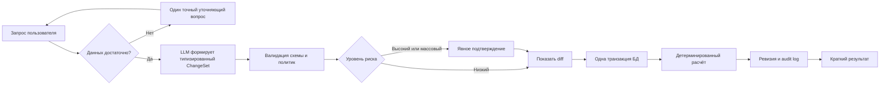

# План доведения решения до промышленной эксплуатации

## Назначение документа и рекомендация руководству

Этот документ описывает порядок превращения прототипа BIOCAD Gantt chart в промышленный продукт: сознательно оставленный технический долг, недостающие продуктовые возможности, риски, целевую архитектуру, последовательность закрытия работ, экономику и критерии принятия решений.

BIOCAD — российская компания с численностью более 3 000 сотрудников. Поэтому целевая система должна проектироваться не как публичный небольшой SaaS, а как внутренний корпоративный сервис: с интеграцией в существующую инфраструктуру BIOCAD, корпоративным входом, правилами информационной безопасности компании и возможностью поэтапного подключения большого числа подразделений и проектов. Внутренние трудовые затраты в этом документе выражаются в рублях; доллары используются только для внешних сервисов, которые выставляют цены в долларах, например AI API или Render.

Текущее приложение подтверждает жизнеспособность пользовательского сценария, но ещё не готово для хранения и изменения рабочих данных компании. Рекомендуемый вариант — поэтапная программа длительностью 24–32 недели, завершающаяся ограниченным промышленным пилотом. Финансирование следует выделять траншами после прохождения контрольных точек, а не утверждать весь бюджет безусловно.

Ключевая архитектурная рекомендация — заменить открытый ReAct-цикл на ограниченный конвейер планирования. Модель должна распознавать намерение пользователя и задавать уточняющие вопросы, но проверка прав, бизнес-правил, расписания и фиксация изменений должны выполняться детерминированными сервисами, а не языковой моделью.

## Проверка исходных идей

Все предложенные владельцем продукта идеи включены в план явно, а не подразумеваются косвенно.

| № | Исходная идея | Где и как она закрывается |
| ---: | --- | --- |
| 1 | Это прототип: нельзя добавлять сотрудников, схема данных ограничена, для всех принято восемь рабочих часов в день, нет персонализации трудозатрат | Разделы «Текущий прототип» и «Организация, сотрудники и загрузка»: справочник сотрудников, индивидуальные календари, ставки доступности, отпуска, часовые пояса, разделение длительности и трудоёмкости, расширяемая схема |
| 2 | Нужна масштабируемость на множество проектов и не должно требоваться повторное создание одинаковых задач | Разделы «Проекты, портфели и повторное использование» и P1: портфели, программы, версионируемые шаблоны, клонирование проектов, библиотека стандартных процессов, межпроектные зависимости |
| 3 | Нужен дополнительный слой безопасности взаимодействия с агентом и защита данных компании при использовании внешнего AI | Раздел «Закрытие рисков безопасности и данных»: интеграция принятого в BIOCAD способа входа, наследование корпоративных security policy, авторизация вне prompt, policy engine, подтверждение изменений, аудит, классификация и минимизация данных, DLP и внутренний маршрут для закрытых данных |
| 4 | Решение должно быть оптимальным; Qwen3.7 Flash нельзя выбирать без собственного сравнения; предпочтителен не-ReAct агент | Разделы «Целевая AI-архитектура», «Выбор модели и собственный benchmark» и P2: типизированный `ChangeSet` вместо ReAct, сравнение моделей по качеству, безопасности, задержке и цене на данных BIOCAD, выбор минимальной стоимости только после прохождения порогов качества |

## Текущий прототип: возможности и сознательные ограничения

Прототип демонстрирует полный пользовательский путь: просмотр диаграммы Ганта, импорт и экспорт Excel, ручное редактирование задач и массовое изменение плана на естественном языке. Детерминированный планировщик проверяет зависимости и рассчитывает даты и человеко-часы. Это полезная основа для пилота.

Однако перечисленные ниже упрощения являются блокерами промышленной эксплуатации.

| Область | Текущее состояние | Последствие |
| --- | --- | --- |
| Хранение | Проект, ревизии и preview импорта находятся в памяти процесса | Данные теряются при перезапуске, горизонтальное масштабирование невозможно |
| Сотрудники | Один предзаполненный проект и фиксированный список людей | Нельзя добавлять сотрудников, подрядчиков, команды, роли и подразделения |
| Рабочее время | Каждый исполнитель считается работающим восемь часов ежедневно | Не учитываются неполная занятость, отпуска, выходные, смены, часовые пояса и параллельные проекты |
| Схема проекта | У задачи небольшой фиксированный набор полей | Нет milestones, ограничений, baseline, статуса, факта, риска, стоимости, custom fields и согласования |
| Масштаб компании | Приложение обслуживает один проект, задачи создаются отдельно | Одинаковые планы приходится создавать заново вручную или через AI |
| Совместная работа | Нет входа, владельцев, комментариев, уведомлений и разрешения конфликтов | Нельзя безопасно работать нескольким пользователям и устанавливать ответственность |
| Аудит и восстановление | Есть только ограниченный undo в памяти | Нет долговечной истории, доказательств действий и надёжного rollback |
| AI | ReAct-агент итеративно вызывает изменяющие инструменты | Возможны циклы tool calls, неоднозначные правки, избыточные полномочия, задержки и лишняя стоимость |
| Защита данных | Контекст проекта отправляется внешнему AI-провайдеру | Конфиденциальные сведения могут пересечь недопустимую границу доверия |
| Эксплуатация | Бесплатный hosting, нет SLO, alerting, runbook и дежурной поддержки | Нет гарантированной доступности, восстановления и владельца сервиса |
| Качество | Есть unit- и API-тесты, но покрытие ограничено | Не доказаны производительность, безопасность, доступность интерфейса и корректность больших графиков |

### Render для прототипа и hosting для production

Render — удачный инструмент для быстрого выполнения тестового задания: он позволяет без отдельной инфраструктурной команды развернуть React frontend и FastAPI backend, показать рабочий сценарий и быстро выпускать изменения. Для прототипа такая скорость важнее промышленной интеграции.

Для production Render следует заменить на hosting, одобренный и управляемый BIOCAD. Причины: корпоративный network perimeter, управление доступом и секретами, утверждённые backup/monitoring процессы, требования к размещению данных, внутренние SLO и incident management. Точная площадка должна быть выбрана совместно с инфраструктурной и security-командами BIOCAD.

Переход выполняется до промышленного пилота:

1. Описать приложение как переносимый container/manifest без зависимости от Render-specific возможностей.
2. Развернуть dev/test/stage в инфраструктуре BIOCAD и подключить корпоративные registry, secrets, logs и monitoring.
3. Перенести backend, PostgreSQL и background jobs во внутренний контур; frontend публиковать принятым в компании способом.
4. Проверить network policy, DNS/TLS, backup/restore, отказоустойчивость и rollback.
5. Отключить production-данные и ключи от Render. Render можно оставить только для обезличенной демонстрационной версии, если это разрешено правилами BIOCAD.

## Принципы промышленного решения

1. **Детерминированное ядро.** Даты, права, доступность сотрудников, стоимость, валидация и хранение не должны зависеть от решения модели.
2. **Минимальные полномочия.** AI формирует типизированное предложение, но не получает доступ к базе данных и неограниченным инструментам.
3. **Контроль человека по уровню риска.** Удаление, массовые и межпроектные изменения, изменение стоимости и неоднозначные запросы требуют preview и подтверждения.
4. **Минимизация данных.** Во внешнюю модель передаётся только минимальный разрешённый контекст.
5. **Повторное использование.** Справочники сотрудников, календари, шаблоны задач и структура портфеля заменяют константы прототипа.
6. **Сначала измерение, затем оптимизация.** Модель, инфраструктура и UX выбираются по реальным сценариям BIOCAD.
7. **Обратимость.** Каждое изменение атомарно, версионируется, аудируется и может быть отменено.

## Целевой продукт

### Организация, сотрудники и загрузка

- создание, изменение, архивирование сотрудников, подрядчиков, команд, ролей, навыков и подразделений;
- синхронизация с корпоративным directory/HR-источником BIOCAD: при масштабе более 3 000 сотрудников нельзя поддерживать справочник вручную внутри приложения;
- даты найма и увольнения, часовой пояс, рабочий календарь, праздники, отпуск, смены и индивидуальная дневная доступность;
- распределение доступной мощности сотрудника между несколькими проектами;
- историчность параметров занятости, чтобы старые планы оставались воспроизводимыми;
- защищённые правами поля ставки труда и cost center, если они нужны финансовым сценариям;
- предупреждение о перегрузке, ресурсные представления и сравнение сценариев.

Человеко-часы должны рассчитываться на основании трудоёмкости, доли участия и индивидуального календаря. Длительность задачи, трудоёмкость, календарное время и доступная мощность — разные параметры, для которых нужны отдельные поля. Восемь часов могут оставаться значением по умолчанию, но не жёсткой константой.

### Расширение схемы данных

Целевая схема должна включать как минимум:

- организацию, подразделение, пользователя, роль и права;
- портфель, программу, проект, версию и baseline;
- шаблон проекта и версию шаблона;
- задачу, milestone, группу задач, зависимость и lag;
- плановую и фактическую трудоёмкость, длительность, прогресс и статус;
- исполнителя, роль на задаче, процент загрузки и календарь;
- риск, комментарий, вложение, согласование и уведомление;
- custom fields с управляемой схемой;
- ревизию, набор изменений и audit event.

Схема должна расширяться миграциями и версионированными API-контрактами без разрушения существующих проектов и Excel-интеграций.

### Проекты, портфели и повторное использование

- несколько бизнес-единиц, портфелей, программ и проектов;
- поэтапное подключение подразделений и проектов через корпоративные группы доступа, а не одномоментное открытие сервиса всем сотрудникам;
- версионируемые шаблоны проектов с задачами, зависимостями, ролями, длительностями и checklist;
- создание проекта из шаблона с параметрами и контролируемым обновлением версии шаблона;
- библиотека стандартных процессов BIOCAD вместо повторной генерации одинаковых задач моделью;
- межпроектные зависимости, общие milestones, спрос на ресурсы и портфельная отчётность;
- baseline, сценарии, факт, статус, риск, стоимость и процесс согласования;
- массовый импорт и экспорт со стабильными идентификаторами, mapping, validation report и idempotency.

Шаблоны — основной способ создания повторяющихся планов. AI может подобрать шаблон или предложить контролируемую адаптацию, но не должен каждый раз заново генерировать стандартный процесс компании.

## Целевая AI-архитектура: ограниченный planner вместо ReAct

Для промышленной версии рекомендуется отказаться от автономного ReAct-цикла. Большинство запросов являются структурированными командами над известной схемой. Итеративный выбор инструментов увеличивает риск, задержку и стоимость, но не создаёт сопоставимой бизнес-ценности.



Предлагаемый процесс:

1. Небольшой классификатор определяет тип запроса: вопрос, уточнение или изменение плана.
2. Для изменения один вызов модели создаёт версионированный типизированный `ChangeSet`; прямые mutation tools модели не предоставляются.
3. Детерминированный policy layer проверяет пользователя, проект, права на поля, существование задач, циклы, загрузку, количество операций и риск.
4. Интерфейс показывает точный diff и влияние на даты, загрузку и стоимость.
5. Подтверждённые изменения фиксируются один раз, атомарно, с idempotency key и неизменяемой ревизией.
6. Краткий ответ формируется из фактического результата транзакции.

Дополнительный вызов модели допускается только для уточнения или однократного исправления невалидного structured output. Таким образом исчезают бесконтрольные tool-call циклы, а верхняя граница задержки и стоимости становится предсказуемой.

## Выбор модели и собственный benchmark

`qwen/qwen3.7-flash` подходит как дешёвая модель прототипа, но пока не является обоснованным выбором для промышленной эксплуатации. OpenRouter сейчас указывает цену Qwen3.7 Flash $0,03 за миллион входных и $0,13 за миллион выходных токенов. Доступность и тарифы могут измениться, поэтому перед закупкой их необходимо перепроверить в [каталоге OpenRouter](https://openrouter.ai/qwen).

Нужно создать закрытый benchmark на согласованных и обезличенных данных BIOCAD:

- 300–500 примеров до пилота и не менее 1 000 после накопления проверенной обратной связи;
- русские и английские запросы;
- единичные и массовые изменения, шаблоны, конфликты загрузки и неоднозначные запросы;
- повреждённый контекст из Excel, prompt injection, запросы без прав и разрушительные операции;
- эталонный `ChangeSet`, решение «выполнить или уточнить», результат policy и ожидаемый ответ.

Модели сравниваются с одинаковыми prompt, схемами, temperature и условиями провайдера.

| Метрика | Вес | Минимальный порог |
| --- | ---: | --- |
| Семантическая точность `ChangeSet` | 35% | ≥95% в целом и ≥99% для простых правок |
| Безопасность и правильный отказ/маршрут согласования | 25% | 100% критических кейсов |
| Правильность решения об уточнении | 10% | ≥95% |
| Валидный structured output | 10% | ≥99,5% максимум с одной repair-попыткой |
| p95 полной задержки | 10% | Изначально ≤8 секунд |
| Стоимость успешного запроса | 10% | В пределах утверждённой unit economics |

Выбирать следует самую дешёвую модель, которая проходит все пороги качества и безопасности, а не лидера общего публичного benchmark. Необходимы проверенная fallback-модель и повторное сравнение не реже одного раза в квартал, а также после смены версии или провайдера.

## Закрытие рисков безопасности и данных

Есть две независимые задачи: безопасное взаимодействие пользователя с AI и защита данных компании при работе с внешним провайдером. Обе задачи должны быть закрыты до промышленного запуска.

### Дополнительный safety layer между пользователем, AI и данными

Нельзя вводить для продукта собственную независимую схему логинов и собственный набор security-правил. Система должна интегрироваться с тем способом входа, который уже принят в BIOCAD, использовать корпоративный источник сотрудников и групп и наследовать действующие в компании требования к MFA, паролям, сессиям, увольнению сотрудников, журналированию, сетевому доступу и реагированию на инциденты. Конкретные технологии определяет security/IT BIOCAD; ниже перечислены необходимые свойства, а не замена корпоративной политики.

- корпоративные SSO/identity provider и directory, наследование MFA, контроль сессий и своевременное отключение пользователей;
- RBAC на уровне организации, портфеля, проекта и отдельных полей, исполняемый backend, а не prompt;
- проверка прав до получения контекста и повторная проверка непосредственно перед commit;
- строгие типизированные схемы, лимиты числа операций, rate limits, idempotency и границы транзакции;
- обязательный diff и подтверждение удаления, массовых, межпроектных, финансовых и ресурсных изменений;
- prompt-injection тесты для пользовательского текста, Excel, описаний задач, комментариев и шаблонов;
- безопасный вывод: результат модели не трактуется как HTML, SQL, код или политика доступа;
- неизменяемый аудит входа, чтения, экспорта, импорта, AI-предложения, подтверждения, commit и undo;
- anomaly detection для необычного объёма чтения, массовых правок и систематических отказов policy.

Эти меры закрывают prompt injection, раскрытие чувствительных данных, небезопасную обработку output и excessive agency, описанные проектом [OWASP GenAI Security](https://genai.owasp.org/).

### Защита данных компании и использование внешнего AI

1. Классифицировать поля как публичные, внутренние, конфиденциальные, строго конфиденциальные или регулируемые.
2. Определить, какие классы могут покидать инфраструктуру BIOCAD. Передачу запрещённых классов блокировать программно.
3. Минимизировать и обезличивать контекст; по возможности передавать идентификаторы, категории или агрегаты.
4. Провести vendor review: безопасность, privacy, юрисдикция и размещение данных, subprocessors, retention, обучение на данных, удаление и уведомление об инцидентах.
5. Обеспечить шифрование, managed secrets, ротацию ключей, egress allow-list и отдельные service accounts.
6. Предусмотреть self-hosted или иной одобренный компанией маршрут для данных, которые нельзя передавать внешней модели.
7. Логировать технические метаданные и решения policy без hidden reasoning и лишнего содержимого prompt.
8. Согласовать retention, legal hold, backup, экспорт и удаление с ответственными за безопасность, данные и право.
9. Применить существующие BIOCAD secure-development, vulnerability-management, incident-response и vendor-management процедуры вместо создания параллельного процесса только для этого продукта.

В качестве основы управления AI-риском можно использовать цикл govern–map–measure–manage из [профиля NIST для генеративного AI](https://www.nist.gov/publications/artificial-intelligence-risk-management-framework-generative-artificial-intelligence). Применимые требования должен отдельно подтвердить юридический блок BIOCAD; этот roadmap не является юридическим заключением.

## Backlog доведения до production

### P0 — корректность, долговечность и эксплуатация

1. Заменить память процесса на PostgreSQL и версионированные migrations.
2. Создать tenant, user, team, calendar, portfolio, project, template, task, dependency, revision и audit модели.
3. Объединить изменение, пересчёт, ревизию и outbox event в одной транзакции.
4. Добавить optimistic concurrency по revision/ETag и idempotency keys.
5. Реализовать неизменяемые ревизии, многошаговые undo/redo, backup, point-in-time recovery и ежеквартальную проверку восстановления.
6. Перенести крупный Excel import/export в ограниченные background jobs с лимитами размера, строк, формул и времени.
7. Добавить structured logs, metrics, traces, dashboards, alerts, health/readiness checks и runbooks.
8. Построить CI/CD с проверкой migrations, dependency/SBOM scanning, подписанными artifacts, staged promotion и rollback.
9. Добавить contract, property-based scheduler, integration, browser E2E, load, resilience и security tests.
10. Перенести приложение с Render в одобренный hosting BIOCAD и принять его по внутренним инфраструктурным и security-чеклистам.

Render остаётся инструментом быстрой демонстрации тестового задания, а не целевой production-площадкой. Бесплатную инфраструктуру нельзя использовать для рабочих данных: например, Render указывает, что бесплатный PostgreSQL прекращает существование через 30 дней — [ограничения бесплатного тарифа](https://render.com/docs/free). Production размещается во внутреннем или ином официально одобренном контуре BIOCAD.

### P1 — сотрудники, продукты и портфели

1. Реализовать справочник сотрудников и индивидуальные календари/доступность.
2. Разделить effort, duration, allocation и elapsed time.
3. Добавить CRUD, ownership, lifecycle, archive и поиск проектов/портфелей.
4. Добавить версии шаблонов, клонирование, повторно используемые группы задач и каталог стандартных процессов.
5. Реализовать baseline, факт, сценарии, ресурсы портфеля и межпроектные зависимости.
6. Добавить комментарии, упоминания, уведомления, согласования и разрешение конфликтов.
7. Завершить русскую/английскую локализацию, работу с часовыми поясами, accessibility и browser testing.

### P1 — redesign и безопасность AI

1. Заменить ReAct на ограниченный типизированный `ChangeSet` pipeline.
2. Версионировать prompt, схемы, policy, benchmark и конфигурацию моделей.
3. Добавить risk scoring, авторизацию, preview, approval, spend limits и tenant quotas.
4. Хранить историю диалога и метаданные AI согласно утверждённой retention policy.
5. Добавить timeout, ограниченный retry, circuit breaker, fallback и полноценный ручной режим без AI.
6. Измерять качество, безопасность, correction rate, отклонения approval, latency и стоимость по типу запроса и модели.
7. Провести threat modeling, adversarial testing и независимый security assessment.

### P2 — масштабирование и оптимизация

- incremental scheduling и virtualization для десятков тысяч задач;
- очереди с backpressure, cancellation, deduplication и dead-letter обработкой;
- read replicas и cache только после подтверждения измерениями;
- анализ запросов/индексов, load test, capacity model и autoscaling thresholds;
- выбор минимального контекста и prompt caching;
- детерминированные bulk operations вместо одного AI/tool цикла на задачу;
- асинхронный расчёт портфельных агрегатов, где не требуется мгновенная согласованность;
- интеграции по подтверждённому спросу: Microsoft Project, Jira, ERP/HR, документооборот и контролируемые API.

Оптимальность означает минимальную полную стоимость при требуемых качестве, безопасности и надёжности, а не только самую дешёвую модель или сервер.

## Порядок закрытия и контрольные точки

Потоки могут частично идти параллельно после закрытия зависимостей. План рассчитан на компактную постоянную команду из product manager и full-stack AI-native разработчика. Designer, DevOps, QA, security и domain SME подключаются только к соответствующим этапам. Сроки предполагают своевременные решения корпоративных владельцев инфраструктуры, данных и безопасности; задержка таких решений сдвигает календарный срок, но не требует автоматически расширять постоянную команду.

| Этап | Срок | Основной результат | Решение и ответственный |
| --- | ---: | --- | --- |
| 0. Исследование и governance | 2–3 недели | Владельцы, пользователи, классификация данных, baseline процессов, архитектура, бюджет, risk register | Спонсор/CFO утверждает ограниченный бюджет до пилота |
| 1. Надёжный фундамент | 6–8 недель | PostgreSQL, tenancy, revisions, транзакции, backup/restore, CI/CD, observability | CTO принимает результат восстановления и operating model |
| 2. Продуктовый фундамент | 6–8 недель | Сотрудники, календари, проекты, портфели, шаблоны, baseline, collaboration | Product owner и SME принимают ключевые сценарии |
| 3. Security и AI redesign | 6–10 недель параллельно этапу 2 | Корпоративный вход BIOCAD, RBAC, policy engine, аудит, data controls, non-ReAct pipeline, benchmark, vendor review | CISO/DPO/legal принимают остаточный риск; модель проходит пороги |
| 4. Performance и готовность пилота | 4–6 недель | Load/resilience tests, runbooks, обучение, migration rehearsal, UAT, accessibility, rollback plan | Совместное go/no-go Product, CTO, CISO и бизнеса |
| 5. Ограниченный промышленный пилот | 6–8 недель | 2–3 реальных проекта, еженедельные KPI, incidents, обратная связь и фактическая экономика | CFO/спонсор решает: масштабировать, доработать или остановить |
| 6. Развёртывание и закрытие программы | 4–8 недель | Поэтапное подключение, библиотека шаблонов, передача эксплуатации, остаточные риски, benefits dashboard | Программа закрывается после приёмки BAU-владельцами и бюджета |

Правила контрольных точек:

- этап не начинается без владельца, критериев приёмки, обновлённого прогноза и выделенной команды;
- красный риск безопасности или данных блокирует запуск независимо от уже понесённых затрат;
- отклонение прогноза более чем на 15% требует переоценки и решения спонсора;
- пилот должен оставаться обратимым, нельзя заранее переносить все проекты;
- непрохождение качества или экономических KPI запускает одну ограниченную доработку, а не бесконечное продолжение.

## Экономика и лимит финансирования

Для этого продукта не нужна большая постоянная команда. Базовый вариант — product manager и один сильный full-stack AI-native разработчик на всём протяжении работ. Designer, DevOps, QA, специалисты по безопасности и владельцы корпоративных платформ подключаются эпизодически к конкретным результатам. Если инфраструктурные или security-команды BIOCAD требуют значительного объёма интеграции, срок следует увеличить, а не заранее содержать расширенный состав.

Внутренние зарплаты и затраты приведены в рублях. Значения являются условными допущениями для сравнения вариантов, а не утверждением о зарплатах BIOCAD или исследованием рынка. CFO должен заменить их внутренними ставками, налогами и overhead. Доллары оставлены только для внешних сервисов с валютными тарифами.

### Компактная команда

| Роль | Участие | Условная начисленная зарплата в месяц | Эквивалент затрат проекта в месяц |
| --- | ---: | ---: | ---: |
| Product manager | 100% весь проект | 220–320 тыс. ₽ | 220–320 тыс. ₽ |
| Full-stack AI-native разработчик | 100% весь проект | 350–500 тыс. ₽ | 350–500 тыс. ₽ |
| Designer | 10–20%, исследования и ключевые экраны | 180–280 тыс. ₽ | 18–56 тыс. ₽ |
| DevOps/инфраструктурный инженер | 10–20%, перенос и запуск | 250–400 тыс. ₽ | 25–80 тыс. ₽ |
| QA | 15–25% перед контрольными точками и пилотом | 180–280 тыс. ₽ | 27–70 тыс. ₽ |
| Security, data и domain SME | Короткие внутренние консультации и приёмка | По внутренним ставкам | Отдельный лимит времени подразделений |

Product manager отвечает за scope, приоритеты, benchmark, пилот и экономику. Full-stack AI-native разработчик ведёт frontend, backend, data model, AI pipeline и автоматические тесты. Эпизодические специалисты не заменяют обязательную приёмку своих областей: designer принимает UX, DevOps — deployment и observability, QA — release evidence, security BIOCAD — доступ и защиту данных.

### Разовые инвестиции до промышленного пилота

| Статья | Основание | Минимум | Максимум |
| --- | --- | ---: | ---: |
| Product manager и full-stack разработчик | 6 месяцев полной занятости | 3,42 млн ₽ | 4,92 млн ₽ |
| Designer, DevOps и QA | Эпизодическое участие согласно таблице выше | 0,42 млн ₽ | 1,24 млн ₽ |
| Security/data/SME и приёмка | Внутренние консультации, threat review и контрольные точки | 0,20 млн ₽ | 0,60 млн ₽ |
| Перенос в hosting BIOCAD, обучение и pilot migration | Используются существующие корпоративные платформы | 0,15 млн ₽ | 0,40 млн ₽ |
| Подытог внутренних затрат | До резерва и начислений работодателя | 4,19 млн ₽ | 7,16 млн ₽ |
| Управленческий резерв | 15% на неизвестные интеграции | 0,63 млн ₽ | 1,07 млн ₽ |
| **Ориентир первого шестимесячного цикла до pilot gate** | Без налогов/overhead и внешних валютных сервисов | **4,82 млн ₽** | **8,23 млн ₽** |

Нижняя граница предполагает повторное использование SSO, hosting, PostgreSQL, monitoring, CI/CD и security-процессов BIOCAD. Если такие платформы отсутствуют или продукт должен сам их создавать, бюджет и срок необходимо пересматривать на отдельной контрольной точке.

Если из-за корпоративных интеграций работа продолжается дольше шести месяцев, каждый дополнительный месяц требует примерно 0,64–1,03 млн ₽ на базовую и эпизодическую команду до налогов/overhead. Такое продление утверждается отдельно по фактическому результату шестимесячного gate, а не включается заранее в раздутую команду.

Финансирование траншами:

- 10% — discovery и архитектурно-безопасностные решения;
- 35% — после Gate 0 на надёжный фундамент;
- 30% — после доказательства долговечности на продукт и AI controls;
- 15% — после security approval на готовность пилота;
- 10% — только после входа в пилот как резерв доработки и rollout.

### Годовая стоимость эксплуатации

| Внутренняя статья | Плановый диапазон в год | Основной фактор |
| --- | ---: | --- |
| Product manager | 2,64–3,84 млн ₽ | Постоянное развитие, adoption, templates и KPI |
| Full-stack AI-native разработчик | 4,20–6,00 млн ₽ | Разработка, поддержка и качество |
| Эпизодические designer/DevOps/QA/security | 0,80–1,80 млн ₽ | Релизы, аудит, инфраструктурные изменения |
| Дополнительная стоимость внутренних compute/storage/backup | 0,30–1,20 млн ₽ | Рассчитывается платформенной командой BIOCAD |
| **Ориентир внутреннего run-rate** | **7,94–12,84 млн ₽** | До налогов и overhead; заменить внутренними ставками |

Внешние сервисы учитываются отдельно в валюте их тарифа:

| Внешний сервис | Плановый лимит | Комментарий |
| --- | ---: | --- |
| OpenRouter/AI API | $100–$3 000 в год | До собственного benchmark и измерения реальной нагрузки |
| Render | $0–$500 в год | Только прототип или обезличенная demo-среда; в production не используется |
| Иные внешние SaaS | $0–$3 000 в год | Только после vendor/security approval BIOCAD |

При текущей цене Qwen3.7 Flash raw inference, вероятно, будет малой частью полной стоимости. Пример: 50 000 пользовательских операций в месяц × 1,5 вызова × 6 000 входных и 400 выходных токенов — около 450 млн входных и 30 млн выходных токенов, или примерно $17,40 в месяц по тарифу $0,03/$0,13 за миллион. Пример не учитывает изменение тарифов, long-context tiers, retries, fallback, gateway, налоги и более дорогие модели. Это показывает, что безопасность, качество, труд команды и эксплуатация важнее минимальной цены токена.

Формула прогноза:

```text
стоимость AI в месяц = запросы × вызовы модели на запрос
                      × ((input tokens × input price/M)
                      +  (output tokens × output price/M)) / 1 000 000
```

Нужно учитывать фактическую стоимость успешного запроса из ответа провайдера, установить alerts на 50%, 75% и 90% бюджета и жёсткие tenant/company limits. Валютные расходы пересчитываются в рубли по утверждённому финансовому курсу на момент планирования. Render отдельно тарифицирует платные compute/storage — [описание billing](https://render.com/docs/faq), но эти расходы относятся только к прототипу: production должен работать на hosting BIOCAD.

### Выгоды и инвестиционное обоснование

До финансирования rollout на этапе 0 необходимо измерить:

- часы на создание, изменение, сверку и отчётность по планам;
- объём повторяющихся задач и потенциал применения шаблонов;
- ошибки планирования, rework, пропущенные зависимости и срок согласования;
- число активных пользователей/проектов и ожидаемый объём запросов;
- стоимость задержки критичных milestones, если финансы могут её доказательно оценить.

```text
выгода труда = подходящие часы планирования × ожидаемое сокращение × полная стоимость часа
выгода качества = предотвращённые ошибки/инциденты × подтверждённая средняя стоимость
выгода сроков = предотвращённые дни задержки × утверждённая стоимость дня
чистая годовая выгода = труд + качество + сроки - годовой run-rate
```

Рекомендуемые business gates пилота:

- не менее 25% сокращения времени повторяющихся операций планирования;
- не менее 30% подходящих новых проектов создаются из управляемых шаблонов;
- не менее 80% weekly active use среди обученных пилотных пользователей;
- менее 5% AI-предложений требуют исправления в разрешённых классах запросов;
- ноль неавторизованных или неподтверждённых high-risk commits;
- прогноз окупаемости не более 18–24 месяцев по утверждённой CFO модели.

Если пилот не проходит пороги, допускается один remediation cycle длительностью 4–6 недель с заранее установленным бюджетом. Затем необходимо сузить scope, продолжить без AI или остановить программу.

## Основные риски и финансовый контроль

| Риск | Потенциальный ущерб | Контроль и блокирующий триггер | Владелец |
| --- | --- | --- | --- |
| Потеря/повреждение данных | Остановка работы и rework | Транзакции, PITR, restore drills; запуск блокируется при неуспешном restore | CTO/SRE |
| Передача конфиденциальных данных | Правовой, IP и репутационный ущерб | Классификация, DLP, одобренный endpoint и договор; запрещённые классы блокируются | CISO/DPO/legal |
| Непреднамеренное изменение AI | Нарушение сроков, ресурсов или стоимости | Typed proposal, policy, diff, approval и revision | Product/CTO |
| Несанкционированный доступ | Существенный security incident | Backend RBAC, row-level tests, audit и penetration test; ноль critical findings | CISO |
| Низкое принятие пользователями | Невозвратные инвестиции | Co-design, шаблоны, обучение и pilot KPI; остановка на gate | Product owner |
| Деградация модели/провайдера | Ошибки или простой | Version pinning, benchmark, fallback/manual mode и circuit breaker | AI owner |
| Перерасход | Отклонение бюджета | Unit-cost dashboard, quotas и транши; повторное утверждение при >15% | Product owner/CFO |
| Недостаточная производительность портфеля | Задержки и аварийная переработка | Representative load model и capacity test до migration | CTO |
| Зависимость от отдельных людей | Срыв поддержки или delivery | Runbooks, code ownership, rotation, обучение и exit plan | Engineering manager |

## Критерии готовности к production

Готовность должна подтверждаться evidence:

- долговечное транзакционное хранение и успешный backup/restore drill;
- RPO не более 15 минут и RTO не более 4 часов либо более строгие значения из business impact analysis;
- целевая доступность сервиса не ниже 99,9%;
- p95 не-AI операций не более 2 секунд под согласованной нагрузкой;
- tenant isolation, интеграция принятого в BIOCAD способа входа и правил защиты, RBAC, полный аудит и отсутствие открытых блокирующих critical/high security findings;
- одобренный путь внешней модели или внутренний вариант для закрытых данных;
- 100% прохождение критических safety tests и утверждённые пороги качества, latency и cost;
- preview/approval всех high-risk mutations и детерминированный rollback;
- browser/accessibility testing, migration rehearsal, monitoring, alerts и incident/restore runbooks;
- назначенные владельцы продукта, сервиса, безопасности, данных и бюджета;
- утверждённый CFO run-rate и действующий benefits dashboard.

## Передача в эксплуатацию и закрытие программы

Программа считается закрытой только после передачи владельцам BAU:

- продуктового scope, service catalogue, support model и roadmap backlog;
- architecture decision records и модели данных;
- threat model, privacy/security assessment, решения по провайдеру и residual-risk register;
- benchmark, model card, версий prompt/schema и rollback configuration;
- operating budget, supplier contracts, quotas и cost dashboards;
- SLO, dashboards, alerts, backup evidence, incident/restore runbooks и on-call ownership;
- результата migration, обучения, adoption metrics и baseline выгод;
- итогового отчёта пилота с решением scale/narrow/stop и подписями ответственных.

CFO следует утверждать масштабирование только после подтверждения управляемого риска и измеримой экономической ценности. Техническая готовность необходима, но без эксплуатационного владельца, принятия пользователями и обоснованной окупаемости она недостаточна.
